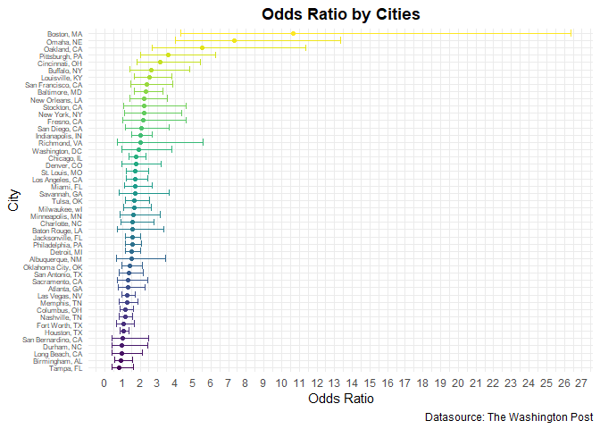
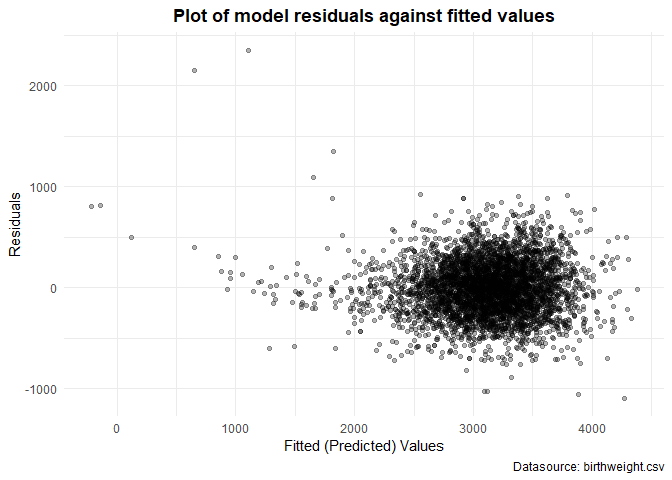
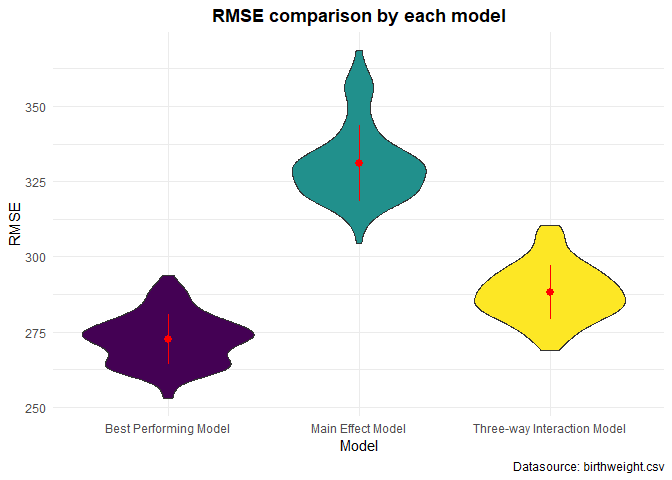
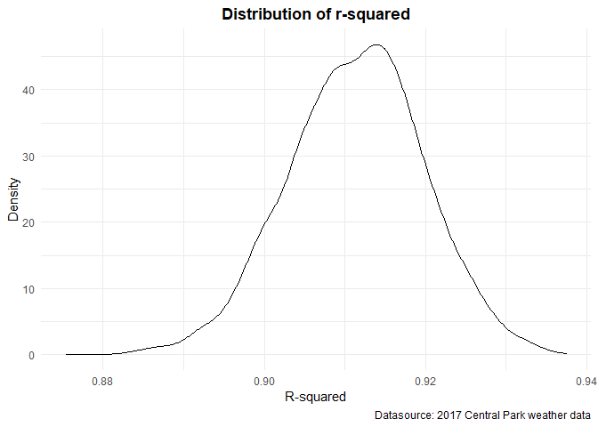
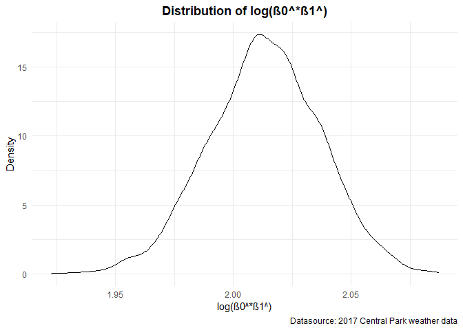

P8105 Homework 6
================
Kyung Suk Lee
2020-12-07

  - [Problem 1](#problem-1)
  - [Problem 2](#problem-2)
  - [Problem 3](#problem-3)

## Problem 1

``` r
homicide_df = 
  read_csv("./data/homicide-data.csv", na = c("", "NA", "Unknown")) %>%
  janitor::clean_names() %>% 
  mutate(
    city_state = str_c(city, state, sep = ", "),
    victim_age = as.numeric(victim_age),
    resolution = case_when(
      disposition == "Closed without arrest" ~ 0,
      disposition == "Open/No arrest"        ~ 0,
      disposition == "Closed by arrest"      ~ 1
  )) %>% 
  filter(!(city_state %in% c("Dallas, TX", "Phoenix, AZ", "Kansas City, MO", "Tulsa, AL")),
         victim_race %in% c("White", "Black")) %>% 
  select(city_state, resolution, victim_age, victim_race, victim_sex)
```

``` r
baltimore_df = 
  homicide_df %>% 
  filter(city_state == "Baltimore, MD")

glm(resolution ~ victim_age + victim_race + victim_sex,
    data = baltimore_df, family = binomial()) %>% 
  broom::tidy() %>% 
  mutate(
    OR = exp(estimate),
    CI_lower = exp(estimate - 1.96*std.error),
    CI_upper = exp(estimate + 1.96*std.error)
  ) %>% 
  select(term, OR, starts_with("CI")) %>% 
  knitr::kable(digits = 3,
               format = "html",
               caption = "Table: Estimate and confidence interval of the adjusted odds ratio")
```

<table>

<caption>

Table: Estimate and confidence interval of the adjusted odds ratio

</caption>

<thead>

<tr>

<th style="text-align:left;">

term

</th>

<th style="text-align:right;">

OR

</th>

<th style="text-align:right;">

CI\_lower

</th>

<th style="text-align:right;">

CI\_upper

</th>

</tr>

</thead>

<tbody>

<tr>

<td style="text-align:left;">

(Intercept)

</td>

<td style="text-align:right;">

1.363

</td>

<td style="text-align:right;">

0.975

</td>

<td style="text-align:right;">

1.907

</td>

</tr>

<tr>

<td style="text-align:left;">

victim\_age

</td>

<td style="text-align:right;">

0.993

</td>

<td style="text-align:right;">

0.987

</td>

<td style="text-align:right;">

1.000

</td>

</tr>

<tr>

<td style="text-align:left;">

victim\_raceWhite

</td>

<td style="text-align:right;">

2.320

</td>

<td style="text-align:right;">

1.648

</td>

<td style="text-align:right;">

3.268

</td>

</tr>

<tr>

<td style="text-align:left;">

victim\_sexMale

</td>

<td style="text-align:right;">

0.426

</td>

<td style="text-align:right;">

0.325

</td>

<td style="text-align:right;">

0.558

</td>

</tr>

</tbody>

</table>

``` r
models_results_df = 
  homicide_df %>% 
    nest(data = -city_state) %>% 
    mutate(
      models = map(.x = data, ~glm(resolution ~ victim_age + victim_race + victim_sex,
                                   data = .x,
                                   family = binomial())),
      results = map(models, broom::tidy)
    ) %>% 
    select(city_state, results) %>% 
    unnest(results) %>% 
    mutate(
      OR = exp(estimate),
      CI_lower = exp(estimate - 1.96*std.error),
      CI_upper = exp(estimate + 1.96*std.error)
    ) %>% 
    select(city_state, term, OR, starts_with("CI"))
```

``` r
models_results_df %>% 
  filter(term == "victim_raceWhite") %>% 
  mutate(city_state = fct_reorder(city_state, OR)) %>% 
  ggplot(aes(x = city_state, y = OR, color = city_state))+
  geom_point()+
  geom_errorbar(aes(ymin = CI_lower, ymax = CI_upper))+
  theme(axis.text.y = element_text(size = 6), legend.position = "none") +
  labs(
    title = "Odds Ratio by Cities",
    x = "City",
    y = "Odds Ratio",
    caption = "Datasource: The Washington Post",
    color = "") +
  theme(plot.title = element_text(face="bold",
                                  hjust=0.5,
                                  lineheight=1.2)) +
  scale_y_continuous(breaks = seq(0, 30, by = 1)) +
  coord_flip()
```



  - **Comment on the plot**: The above plot illustrates that for most
    cities the estimates for odds ratio are above 1.0. Such result
    indicates that more homicides are likely to be solved for white
    compared to non-whites. We can observe that this is more apparent in
    cities such as Boston, Omaha, Oakland, and Pittsburgh.

## Problem 2

``` r
birthweight = 
  read_csv("./data/birthweight.csv") %>% 
  janitor::clean_names() %>% 
  mutate(babysex = as.factor(babysex),
         frace = as.factor(frace),
         malform = as.factor(malform),
         mrace = as.factor(mrace),
         babysex = recode(babysex, 
                          "1" = "male", 
                          "2" = "female"),
         frace = recode(frace, 
                        "1" = "white", 
                        "2" = "black", 
                        "3" = "asian", 
                        "4" = "puerto rican", 
                        "8" = "other"),
         malform = recode(malform, 
                          "0" = "absent", 
                          "1" = "present"),
         mrace = recode(mrace, 
                        "1" = "white", 
                        "2" = "black", 
                        "3" = "asian", 
                        "4" = "puerto rican"))

birthweight %>% 
  is.na() %>% 
  summary()
```

``` 
  babysex          bhead          blength           bwt         
 Mode :logical   Mode :logical   Mode :logical   Mode :logical  
 FALSE:4342      FALSE:4342      FALSE:4342      FALSE:4342     
   delwt          fincome          frace          gaweeks       
 Mode :logical   Mode :logical   Mode :logical   Mode :logical  
 FALSE:4342      FALSE:4342      FALSE:4342      FALSE:4342     
  malform         menarche        mheight          momage       
 Mode :logical   Mode :logical   Mode :logical   Mode :logical  
 FALSE:4342      FALSE:4342      FALSE:4342      FALSE:4342     
   mrace           parity         pnumlbw         pnumsga       
 Mode :logical   Mode :logical   Mode :logical   Mode :logical  
 FALSE:4342      FALSE:4342      FALSE:4342      FALSE:4342     
   ppbmi            ppwt           smoken          wtgain       
 Mode :logical   Mode :logical   Mode :logical   Mode :logical  
 FALSE:4342      FALSE:4342      FALSE:4342      FALSE:4342     
```

  - **Comment on the cleaned dataset**: As can be seen above, I have
    loaded and cleaned the initial data for regression analysis by
    converting numeric to factor where appropriate. Also I have checked
    for missing data and there seems to be none.

<!-- end list -->

``` r
initial_model = lm(bwt ~ ., data = birthweight)

fitted_model = step(initial_model, direction = "backward")
```

    Start:  AIC=48717.83
    bwt ~ babysex + bhead + blength + delwt + fincome + frace + gaweeks + 
        malform + menarche + mheight + momage + mrace + parity + 
        pnumlbw + pnumsga + ppbmi + ppwt + smoken + wtgain
    
    
    Step:  AIC=48717.83
    bwt ~ babysex + bhead + blength + delwt + fincome + frace + gaweeks + 
        malform + menarche + mheight + momage + mrace + parity + 
        pnumlbw + pnumsga + ppbmi + ppwt + smoken
    
    
    Step:  AIC=48717.83
    bwt ~ babysex + bhead + blength + delwt + fincome + frace + gaweeks + 
        malform + menarche + mheight + momage + mrace + parity + 
        pnumlbw + ppbmi + ppwt + smoken
    
    
    Step:  AIC=48717.83
    bwt ~ babysex + bhead + blength + delwt + fincome + frace + gaweeks + 
        malform + menarche + mheight + momage + mrace + parity + 
        ppbmi + ppwt + smoken
    
               Df Sum of Sq       RSS   AIC
    - frace     4    124365 320848704 48712
    - malform   1      1419 320725757 48716
    - ppbmi     1      6346 320730684 48716
    - momage    1     28661 320752999 48716
    - mheight   1     66886 320791224 48717
    - menarche  1    111679 320836018 48717
    - ppwt      1    131132 320855470 48718
    <none>                  320724338 48718
    - fincome   1    193454 320917792 48718
    - parity    1    413584 321137922 48721
    - mrace     3    868321 321592659 48724
    - babysex   1    853796 321578134 48727
    - gaweeks   1   4611823 325336161 48778
    - smoken    1   5076393 325800732 48784
    - delwt     1   8008891 328733230 48823
    - blength   1 102050296 422774634 49915
    - bhead     1 106535716 427260054 49961
    
    Step:  AIC=48711.51
    bwt ~ babysex + bhead + blength + delwt + fincome + gaweeks + 
        malform + menarche + mheight + momage + mrace + parity + 
        ppbmi + ppwt + smoken
    
               Df Sum of Sq       RSS   AIC
    - malform   1      1447 320850151 48710
    - ppbmi     1      6975 320855679 48710
    - momage    1     28379 320877083 48710
    - mheight   1     69502 320918206 48710
    - menarche  1    115708 320964411 48711
    - ppwt      1    133961 320982665 48711
    <none>                  320848704 48712
    - fincome   1    194405 321043108 48712
    - parity    1    414687 321263390 48715
    - babysex   1    852133 321700837 48721
    - gaweeks   1   4625208 325473911 48772
    - smoken    1   5036389 325885093 48777
    - delwt     1   8013099 328861802 48817
    - mrace     3  13540415 334389119 48885
    - blength   1 101995688 422844392 49908
    - bhead     1 106662962 427511666 49956
    
    Step:  AIC=48709.53
    bwt ~ babysex + bhead + blength + delwt + fincome + gaweeks + 
        menarche + mheight + momage + mrace + parity + ppbmi + ppwt + 
        smoken
    
               Df Sum of Sq       RSS   AIC
    - ppbmi     1      6928 320857079 48708
    - momage    1     28660 320878811 48708
    - mheight   1     69320 320919470 48708
    - menarche  1    116027 320966177 48709
    - ppwt      1    133894 320984044 48709
    <none>                  320850151 48710
    - fincome   1    193784 321043934 48710
    - parity    1    414482 321264633 48713
    - babysex   1    851279 321701430 48719
    - gaweeks   1   4624003 325474154 48770
    - smoken    1   5035195 325885346 48775
    - delwt     1   8029079 328879230 48815
    - mrace     3  13553320 334403471 48883
    - blength   1 102009225 422859375 49906
    - bhead     1 106675331 427525481 49954
    
    Step:  AIC=48707.63
    bwt ~ babysex + bhead + blength + delwt + fincome + gaweeks + 
        menarche + mheight + momage + mrace + parity + ppwt + smoken
    
               Df Sum of Sq       RSS   AIC
    - momage    1     29211 320886290 48706
    - menarche  1    117635 320974714 48707
    <none>                  320857079 48708
    - fincome   1    195199 321052278 48708
    - parity    1    412984 321270064 48711
    - babysex   1    850020 321707099 48717
    - mheight   1   1078673 321935752 48720
    - ppwt      1   2934023 323791103 48745
    - gaweeks   1   4621504 325478583 48768
    - smoken    1   5039368 325896447 48773
    - delwt     1   8024939 328882018 48813
    - mrace     3  13551444 334408523 48881
    - blength   1 102018559 422875638 49904
    - bhead     1 106821342 427678421 49953
    
    Step:  AIC=48706.02
    bwt ~ babysex + bhead + blength + delwt + fincome + gaweeks + 
        menarche + mheight + mrace + parity + ppwt + smoken
    
               Df Sum of Sq       RSS   AIC
    - menarche  1    100121 320986412 48705
    <none>                  320886290 48706
    - fincome   1    240800 321127090 48707
    - parity    1    431433 321317724 48710
    - babysex   1    841278 321727568 48715
    - mheight   1   1076739 321963029 48719
    - ppwt      1   2913653 323799943 48743
    - gaweeks   1   4676469 325562760 48767
    - smoken    1   5045104 325931394 48772
    - delwt     1   8000672 328886962 48811
    - mrace     3  14667730 335554021 48894
    - blength   1 101990556 422876847 49902
    - bhead     1 106864308 427750598 49952
    
    Step:  AIC=48705.38
    bwt ~ babysex + bhead + blength + delwt + fincome + gaweeks + 
        mheight + mrace + parity + ppwt + smoken
    
              Df Sum of Sq       RSS   AIC
    <none>                 320986412 48705
    - fincome  1    245637 321232048 48707
    - parity   1    422770 321409181 48709
    - babysex  1    846134 321832545 48715
    - mheight  1   1012240 321998651 48717
    - ppwt     1   2907049 323893461 48743
    - gaweeks  1   4662501 325648912 48766
    - smoken   1   5073849 326060260 48771
    - delwt    1   8137459 329123871 48812
    - mrace    3  14683609 335670021 48894
    - blength  1 102191779 423178191 49903
    - bhead    1 106779754 427766166 49950

``` r
fitted_model %>% summary()
```

``` 

Call:
lm(formula = bwt ~ babysex + bhead + blength + delwt + fincome + 
    gaweeks + mheight + mrace + parity + ppwt + smoken, data = birthweight)

Residuals:
     Min       1Q   Median       3Q      Max 
-1097.18  -185.52    -3.39   174.14  2353.44 

Coefficients:
                    Estimate Std. Error t value Pr(>|t|)    
(Intercept)       -6098.8219   137.5463 -44.340  < 2e-16 ***
babysexfemale        28.5580     8.4549   3.378 0.000737 ***
bhead               130.7770     3.4466  37.944  < 2e-16 ***
blength              74.9471     2.0190  37.120  < 2e-16 ***
delwt                 4.1067     0.3921  10.475  < 2e-16 ***
fincome               0.3180     0.1747   1.820 0.068844 .  
gaweeks              11.5925     1.4621   7.929 2.79e-15 ***
mheight               6.5940     1.7849   3.694 0.000223 ***
mraceblack         -138.7925     9.9071 -14.009  < 2e-16 ***
mraceasian          -74.8868    42.3146  -1.770 0.076837 .  
mracepuerto rican  -100.6781    19.3247  -5.210 1.98e-07 ***
parity               96.3047    40.3362   2.388 0.017004 *  
ppwt                 -2.6756     0.4274  -6.261 4.20e-10 ***
smoken               -4.8434     0.5856  -8.271  < 2e-16 ***
---
Signif. codes:  0 '***' 0.001 '**' 0.01 '*' 0.05 '.' 0.1 ' ' 1

Residual standard error: 272.3 on 4328 degrees of freedom
Multiple R-squared:  0.7181,    Adjusted R-squared:  0.7173 
F-statistic: 848.1 on 13 and 4328 DF,  p-value: < 2.2e-16
```

  - **Comment on the modeling process**: As can be seen above, I have
    performed a stepwise regression. The stepwise regression carry out
    adding and removing predictors, in the predictive model, in order to
    find the subset of variables in the data set that results the best
    performing model. As can be seen from the summary, the best
    performing model consists of 13 predictors.

<!-- end list -->

``` r
birthweight %>% 
  add_predictions(., fitted_model) %>% 
  add_residuals(., fitted_model) %>%
  ggplot(aes(x = pred, y = resid)) +
  geom_point(alpha = .3) +
  labs(
    title = "Plot of model residuals against fitted values",
    x = "Fitted (Predicted) Values",
    y = "Residuals",
    caption = "Datasource: birthweight.csv",
    color = "") +
  theme(plot.title = element_text(face="bold",
                                  hjust=0.5,
                                  lineheight=1.2))
```



  - **Comment on the plot**: As can be seen above, the values are
    heavily concentrated between 2500 and 3500 for fitted values and
    between -500 and 500 for residuals.

<!-- end list -->

``` r
# One using length at birth and gestational age as predictors (main effects only)
comparison_model_1 = lm(bwt ~ blength + gaweeks, data = birthweight)

summary(comparison_model_1)
```

``` 

Call:
lm(formula = bwt ~ blength + gaweeks, data = birthweight)

Residuals:
    Min      1Q  Median      3Q     Max 
-1709.6  -215.4   -11.4   208.2  4188.8 

Coefficients:
             Estimate Std. Error t value Pr(>|t|)    
(Intercept) -4347.667     97.958  -44.38   <2e-16 ***
blength       128.556      1.990   64.60   <2e-16 ***
gaweeks        27.047      1.718   15.74   <2e-16 ***
---
Signif. codes:  0 '***' 0.001 '**' 0.01 '*' 0.05 '.' 0.1 ' ' 1

Residual standard error: 333.2 on 4339 degrees of freedom
Multiple R-squared:  0.5769,    Adjusted R-squared:  0.5767 
F-statistic:  2958 on 2 and 4339 DF,  p-value: < 2.2e-16
```

``` r
# One using head circumference, length, sex, and all interactions (including the three-way interaction)
comparison_model_2 = lm(bwt ~ bhead + blength + babysex
                        + bhead*blength + bhead*babysex + blength*babysex
                        + bhead*blength*babysex, data = birthweight)

summary(comparison_model_2)
```

``` 

Call:
lm(formula = bwt ~ bhead + blength + babysex + bhead * blength + 
    bhead * babysex + blength * babysex + bhead * blength * babysex, 
    data = birthweight)

Residuals:
     Min       1Q   Median       3Q      Max 
-1132.99  -190.42   -10.33   178.63  2617.96 

Coefficients:
                              Estimate Std. Error t value Pr(>|t|)    
(Intercept)                 -7176.8170  1264.8397  -5.674 1.49e-08 ***
bhead                         181.7956    38.0542   4.777 1.84e-06 ***
blength                       102.1269    26.2118   3.896 9.92e-05 ***
babysexfemale                6374.8684  1677.7669   3.800 0.000147 ***
bhead:blength                  -0.5536     0.7802  -0.710 0.478012    
bhead:babysexfemale          -198.3932    51.0917  -3.883 0.000105 ***
blength:babysexfemale        -123.7729    35.1185  -3.524 0.000429 ***
bhead:blength:babysexfemale     3.8781     1.0566   3.670 0.000245 ***
---
Signif. codes:  0 '***' 0.001 '**' 0.01 '*' 0.05 '.' 0.1 ' ' 1

Residual standard error: 287.7 on 4334 degrees of freedom
Multiple R-squared:  0.6849,    Adjusted R-squared:  0.6844 
F-statistic:  1346 on 7 and 4334 DF,  p-value: < 2.2e-16
```

``` r
birthweight_cv = 
  crossv_mc(birthweight, 100) %>% 
  mutate(
    train = map(train, as_tibble),
    test  = map(test, as_tibble))

birthweight_cv = 
  birthweight_cv %>% 
  mutate(
    best_fitted = map(train, ~lm(bwt ~ babysex + bhead + blength + delwt + fincome + gaweeks 
                                       + mheight + mrace + parity + ppwt + smoken, data = .x)),
    comparison_1 = map(train, ~lm(bwt ~ blength + gaweeks, data = .x)),
    comparison_2 = map(train, ~lm(bwt ~ bhead + blength + babysex 
                        + bhead*blength + bhead*babysex + blength*babysex 
                        + bhead*blength*babysex, data = .x))) %>%
  mutate(
    rmse_best_fitted = map2_dbl(best_fitted, test, ~rmse(model = .x, data = .y)),
    rmse_comparison_1 = map2_dbl(comparison_1, test, ~rmse(model = .x, data = .y)),
    rmse_comparison_2 = map2_dbl(comparison_2, test, ~rmse(model = .x, data = .y))
  )
```

``` r
birthweight_cv %>% 
  select(starts_with("rmse")) %>% 
  pivot_longer(
    everything(),
    names_to = "model",
    values_to = "rmse",
    names_prefix = "rmse_"
  ) %>% 
  mutate(model = recode(model, best_fitted = "Best Performing Model", 
                        comparison_1 = "Main Effect Model",
                        comparison_2 = "Three-way Interaction Model"),
         model = fct_inorder(model)) %>% 
  ggplot(aes(x = model, y = rmse, fill = model)) + 
  geom_violin() +
  stat_summary(fun.data = "mean_sdl",
               fun.args = list(mult = 1), 
               geom = "pointrange", 
               color = "red") +
  labs(
    title = "RMSE comparison by each model",
    x = "Model",
    y = "RMSE",
    caption = "Datasource: birthweight.csv",
    fill = "") +
  theme(plot.title = element_text(face="bold",
                                  hjust=0.5,
                                  lineheight=1.2)) +
  theme(legend.position = "none")
```



  - **Comment on the plot**: As can be seen above, from the violin plot,
    the model (Best Performing Model) that used stepwise regression
    seemed to have the lowest RMSE distribution compared to other two
    comparison models (Main Effect Model and Three-way Interaction
    Model). The plot illustrates that the prediction accuracy of the
    model takes into account the magnitude of complexity of the model.

## Problem 3

``` r
weather_df = 
  rnoaa::meteo_pull_monitors(
    c("USW00094728"),
    var = c("PRCP", "TMIN", "TMAX"), 
    date_min = "2017-01-01",
    date_max = "2017-12-31") %>%
  mutate(
    name = recode(id, USW00094728 = "CentralPark_NY"),
    tmin = tmin / 10,
    tmax = tmax / 10) %>%
  select(name, id, everything())
```

``` r
bootstrap_sample =
  weather_df %>% 
  bootstrap(n = 5000) 

bootstrap_rsquared = 
  bootstrap_sample %>% 
    mutate(
      models = map(.x = strap, ~lm(tmax ~ tmin, data = .x)),
      result_rsq = map(models, broom::glance)
    ) %>% 
    select(-strap, -models) %>% 
    unnest(result_rsq)

bootstrap_rsquared %>% 
  ggplot(aes(x = r.squared)) +
  geom_density() +
  labs(
   title = "Distribution of r-squared",
   x = "R-squared",
   y = "Density",
   caption = "Datasource: 2017 Central Park weather data",
   fill = "") +
  theme(plot.title = element_text(face="bold",
                                 hjust=0.5,
                                 lineheight=1.2))
```



  - **Comment on the plot**: As can be seen above, from the density
    plot, the distribution of r-squared, in general, is normally
    distributed. The plot is somewhat left skewed which denotes that
    some r-squared values are quite high enough to shift the
    distribution to the right.

<!-- end list -->

``` r
bootstrap_log = 
  bootstrap_sample %>% 
    mutate(
      models = map(.x = strap, ~lm(tmax ~ tmin, data = .x)),
      result_log = map(models, broom::tidy)
    ) %>% 
    select(-strap, -models) %>% 
    unnest(result_log) %>% 
    select(.id, term, estimate) %>% 
    pivot_wider(
      names_from = term,
      values_from = estimate
    ) %>% 
    rename(intercept = "(Intercept)") %>% 
    mutate(log_compute = log(intercept*tmin))

bootstrap_log %>% 
  ggplot(aes(x = log_compute)) +
  geom_density() +
  labs(
    title = "Distribution of log(β0^*β1^)",
    x = "log(β0^*β1^)",
    y = "Density",
    caption = "Datasource: 2017 Central Park weather data",
    fill = "") +
  theme(plot.title = element_text(face="bold",
                                  hjust=0.5,
                                  lineheight=1.2))
```



  - **Comment on the plot**: As can be seen above, from the density
    plot, we are able to notice that the distribution of log(β0^\*β1^),
    in general, is slightly more normally distributed compared to the
    previous distribution of r-squared.

<!-- end list -->

``` r
bootstrap_rsquared %>% 
  pull(r.squared) %>% 
  quantile(c(0.025, 0.975)) %>% 
  knitr::kable(format = "html",
               caption = "Table: 95% confidence interval for r-squared")
```

<table>

<caption>

Table: 95% confidence interval for r-squared

</caption>

<thead>

<tr>

<th style="text-align:left;">

</th>

<th style="text-align:right;">

x

</th>

</tr>

</thead>

<tbody>

<tr>

<td style="text-align:left;">

2.5%

</td>

<td style="text-align:right;">

0.8944140

</td>

</tr>

<tr>

<td style="text-align:left;">

97.5%

</td>

<td style="text-align:right;">

0.9274868

</td>

</tr>

</tbody>

</table>

``` r
bootstrap_log %>% 
  pull(log_compute) %>% 
  quantile(c(0.025, 0.975)) %>% 
  knitr::kable(format = "html",
               caption = "Table: 95% confidence interval for log(β0^*β1^)")
```

<table>

<caption>

Table: 95% confidence interval for log(ß0^\*ß1^)

</caption>

<thead>

<tr>

<th style="text-align:left;">

</th>

<th style="text-align:right;">

x

</th>

</tr>

</thead>

<tbody>

<tr>

<td style="text-align:left;">

2.5%

</td>

<td style="text-align:right;">

1.965942

</td>

</tr>

<tr>

<td style="text-align:left;">

97.5%

</td>

<td style="text-align:right;">

2.058992

</td>

</tr>

</tbody>

</table>
